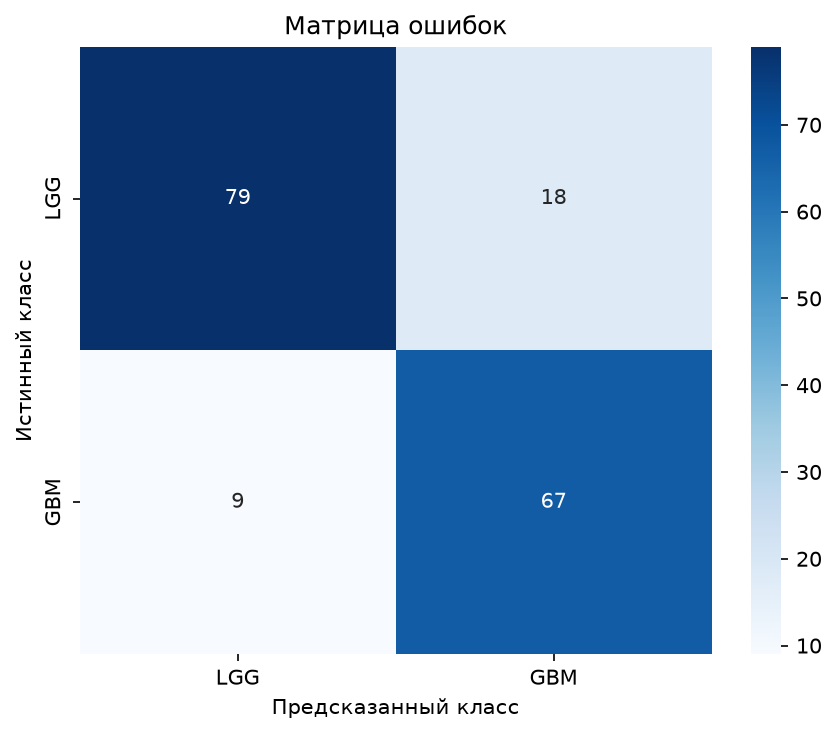
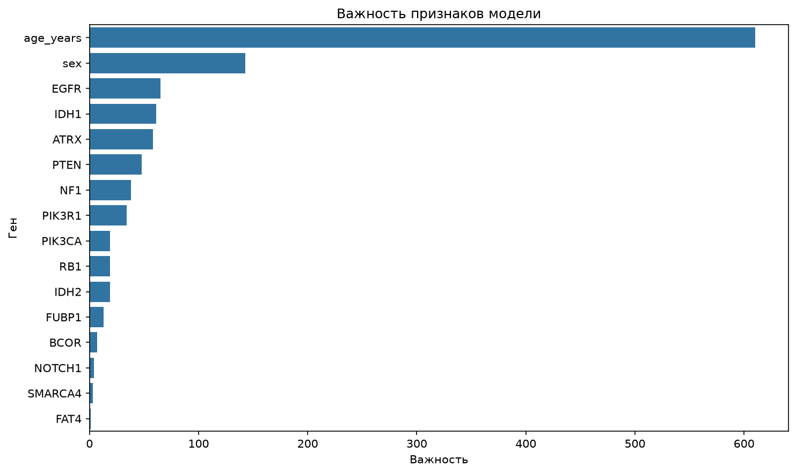
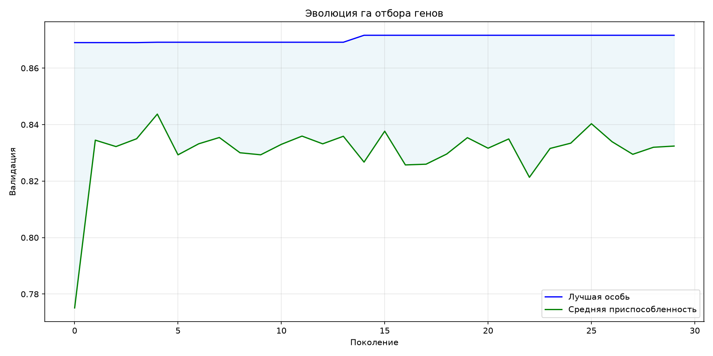

# 🔬 Glioma analysis

**GA_glioma_analysis** — Анализ и предсказание глиомы у пациента с помощью генетического алгоритма а также машинного обучения

---

## 📊 Результаты




---

## 📦 Данные

| Источник | Описание | Размер |
|----------|----------|--------|
| [Glioma Grading Clinical and Mutation Features](https://www.kaggle.com/datasets/vinayjose/glioma-grading-clinical-and-mutation-features) | OHLCV цены BTC | 862 уникальных случая |


## ⚙️ Конфигурация
```bash
ga:
  population_size: 150     
  mutation_rate: 0.2       
  crossover_rate: 0.85
  generations: 50
  random_state: 228
  elitism_ratio: 0.03      
  min_features: 3

#Выбор модели
model:
  type: 'lightgbm'
  random_state: 228
  n_jobs: -1
  
  random_forest:
    n_estimators: 100
    max_depth: 5
    min_samples_split: 2
    min_samples_leaf: 1
    class_weight: 'balanced'
    
  xgboost:
    n_estimators: 100
    max_depth: 5
    learning_rate: 0.1
    subsample: 0.8
    colsample_bytree: 0.8
    use_label_encoder: False
    eval_metric: 'mlogloss'
    
  lightgbm:
    n_estimators: 100
    max_depth: 5
    learning_rate: 0.1
    num_leaves: 31
    subsample: 0.8
    colsample_bytree: 0.8
    
  gradient_boosting:
    n_estimators: 100
    max_depth: 5
    learning_rate: 0.1
    subsample: 0.8
    min_samples_split: 2

#Настройки кросс-валидации
cv:
  cv: 5
  scoring: 'f1_macro'

#Пути внутри репозитория
paths:
  raw_data: "data/raw/TCGA_GBM_LGG_Mutations_all.csv"
  output_dir: "output"
  model_save: "output/best_model.pkl"
  features_save: "output/selected_features.json"
  fitness_plot: "output/fitness_history.png"
  importance_plot: "output/feature_importance.png"
  confusion_matrix_plot: "output/confusion_matrix.png"

#Гены 
genes:
  - IDH1 #Добавление генов
  ...
#Тестовый пациент
test_patient:
  IDH1: 'MUTATED' #Название гена и имеется ли мутация в нем
  ...
  age_years: 51
  sex: 1
```
## Автор
Skriabin Aleksei 2026

